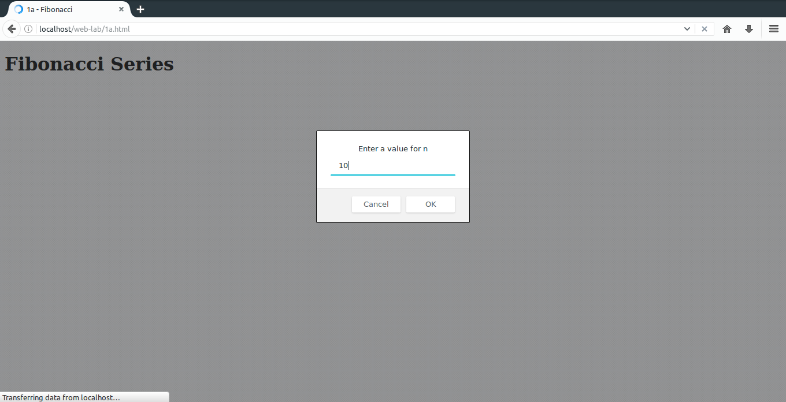
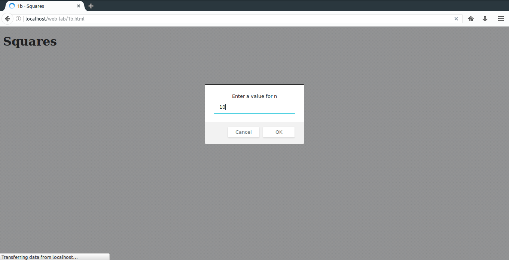
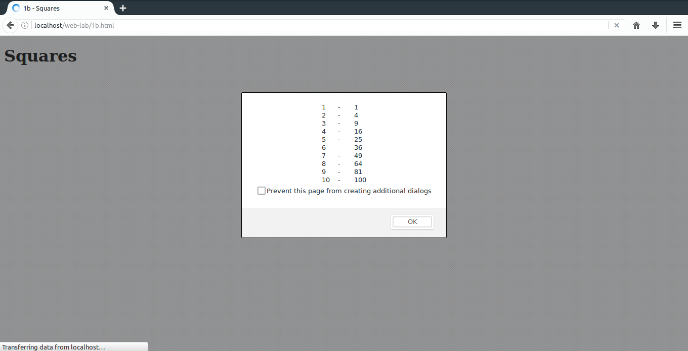

# 1.Develop and demonstrate a XHTML file that includes JavaScript script for the following problems:
#### a) Input: A number n obtained using prompt. &nbsp;&nbsp;&nbsp;&nbsp;Output: The first n Fibonacci numbers.
#### b) Input: A number n obtained using prompt. &nbsp;&nbsp;&nbsp;&nbsp;Output: A table of numbers from 1 to n and their squares using alert.
### Important Bits
* `alert(msg)`:               Displays an alert message. [window.alert()]
* `prompt(msg)`:              Displays an alert message with input box. The function returns the value entered by user. [window.prompt()]
* `document.write(content)`:  Appends content inside body.

### File Path
`/opt/lampp/htdocs/web-lab/1a.html`
### Output

### File Path
`/opt/lampp/htdocs/web-lab/1b.html`
### Output

