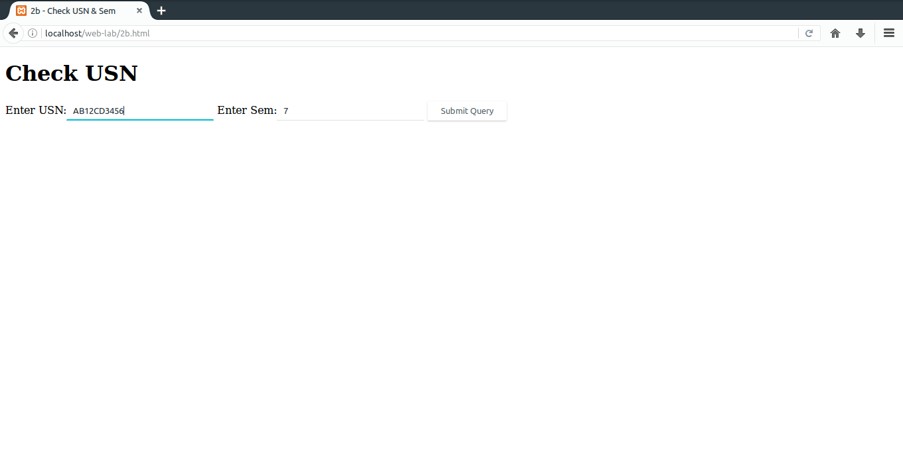

# 2.
#### a) Develop and demonstrate, using Javascript, a XHTML document that collects the USN (the valid format is: A digit from 1 to 4 followed by two upper-case characters followed by two digits followed by two upper-case characters followed by three digits; no embedded spaces allowed) of the user. Event handler must be included for the form element that collects this information to validate the input. Messages in the alert windows must be produced when errors are detected.
### Important bits:
* ```onclick="fn(params...)"``` attribute: Specifies a function that is to be called when a click is encountered.
* ```document.getElementById('id')```:	Returns element whose id was specified.
* ```String.match('pattern')```: Checks if a string matches a specified pattern.

### Code (XHTML)
**File path:** ```/opt/lampp/htdocs/web-lab/2a.html```
```xhtml
<?xml version="1.0" encoding="utf-8"?>
<!DOCTYPE html PUBLIC "-//W3C//DTD XHTML 1.1//EN" "http://www.w3.org/MarkUp/DTD/xhtml11.dtd">
<html xmlns="http://www.w3.org/1999/xhtml">
	<head>
		<title>2a - Check USN</title>
	</head>
	<body>
		<h1>Check USN</h1>
		<form>
			<label>Enter USN:<input id="usn" type="text" /></label>
			<input type="submit" onclick="validate()" />
		</form>
		<script>
			function validate(){
				usn=document.getElementById("usn").value
				if(usn.match(/[1-4][A-Z]{2}[0-9]{2}[A-Z]{2}[0-9]{3}/))	alert("USN Valid")
				else													alert("USN Invalid")
			}
		</script>
	</body>
</html>
```
### Output:


#### b) Modify the above program to get the current semester also (restricted to be a number from 1 to 8)
### Code (XHTML)
**File path:** ```/opt/lampp/htdocs/web-lab/2b.html```
```xhtml
<?xml version="1.0" encoding="utf-8"?>
<!DOCTYPE html PUBLIC "-//W3C//DTD XHTML 1.1//EN" "http://www.w3.org/MarkUp/DTD/xhtml11.dtd">
<html xmlns="http://www.w3.org/1999/xhtml">
	<head>
		<title>2b - Check USN & Sem</title>
	</head>
	<body>
		<h1>Check USN</h1>
		<form>
			<label>Enter USN:<input id="usn" type="text" /></label>
			<label>Enter Sem:<input id="sem" type="text" /></label>
			<input type="submit" onclick="validate()" />
		</form>
		<script>
			function validate(){
				usn=document.getElementById("usn").value
				sem=document.getElementById("sem").value
				if(usn.match(/[1-4][A-Z]{2}[0-9]{2}[A-Z]{2}[0-9]{3}/)){
					if(sem.match(/[1-8]/))	alert("All fields are Valid")
					else					alert("Sem field Invalid")
				}
				else						alert("USN Invalid")
			}
		</script>
	</body>
</html>
```
### Output:





