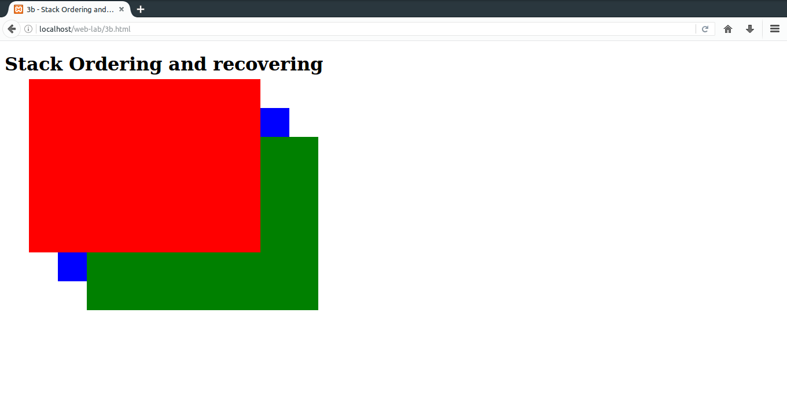

# 3.
#### a) Develop and demonstrate, using JavaScript script, a XHTML document that contains three short paragraphs of text, stacked on top of each other, with only enough of each showing so that the mouse cursor can be placed over some part of  them. When the cursor is placed over the exposed part of any paragraph, it should rise to the top to become completely visible.
#### b) Modify the above document so that when a paragraph is moved from the top stacking position, it returns to its original position rather than to the bottom.
### Important bits
* `onmouseover="fn(params...)"` attribute: Specifies a function that is to be called when mouse hovers over an element.
* `onmouseout="fn(params...)"` attribute: Specifies a function that is to be called when mouse leaves an element.

### File Path
`/var/www/html/web-lab/3a.html`
### Output

### File Path
`/var/www/html/web-lab/3b.html`
### Output

