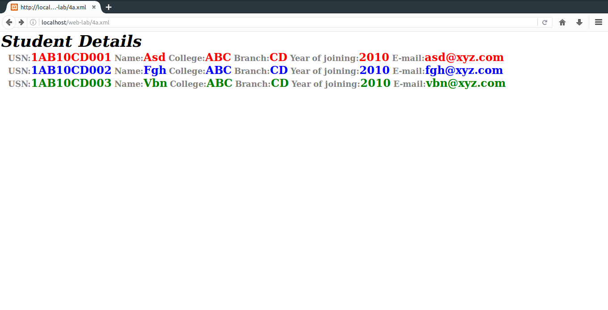
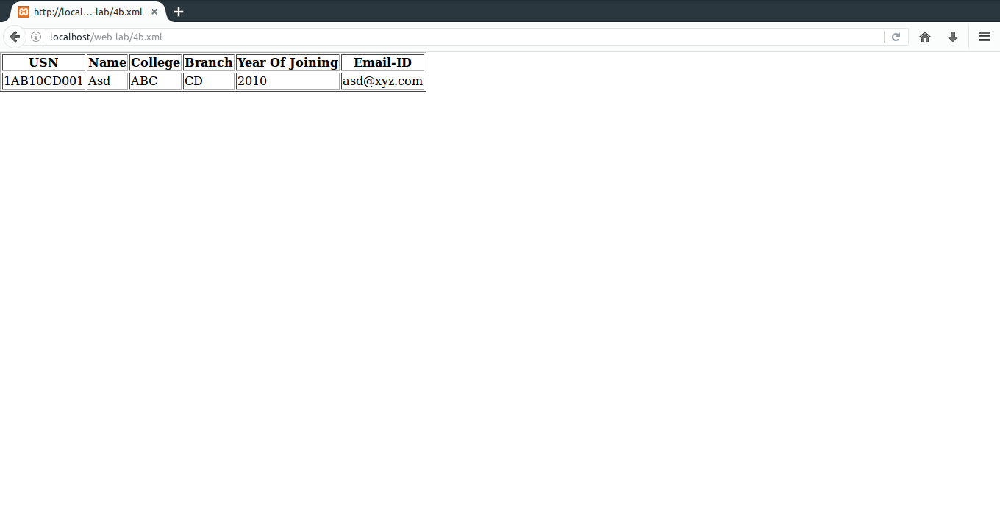

# 4.
#### a) Design an XML document to store information about a student in an engineering college affiliated to VTU. The information must include USN, Name, Name of the College, Brach, Year of Joining, and e-mail id. Make up sample data for 3 students. Create a CSS style sheet and use it to display the document.
#### b) Create an XSLT style sheet for one student element of the above document and use it to create a display of that element.
### Important bits
* `xsl:template match="/tag-path"`: Matches root tag.
* `xsl:for-each select="tag"`: For each loop on all specified elements.
* `xsl:value-of match="tag"`: Value of an element.

### File Paths
`/opt/lampp/htdocs/web-lab/4a.xml`  
`/opt/lampp/htdocs/web-lab/4a.css`
### Output

### File Paths
`/opt/lampp/htdocs/web-lab/4b.xml`  
`/opt/lampp/htdocs/web-lab/4b.xsl`
### Output

