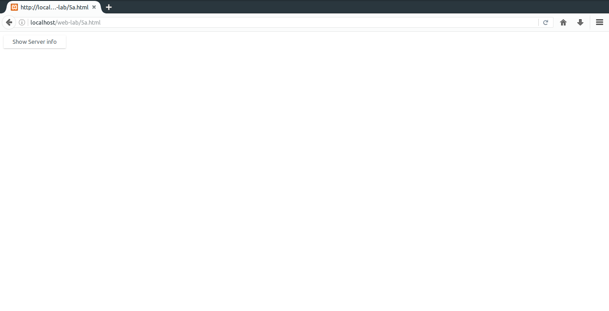
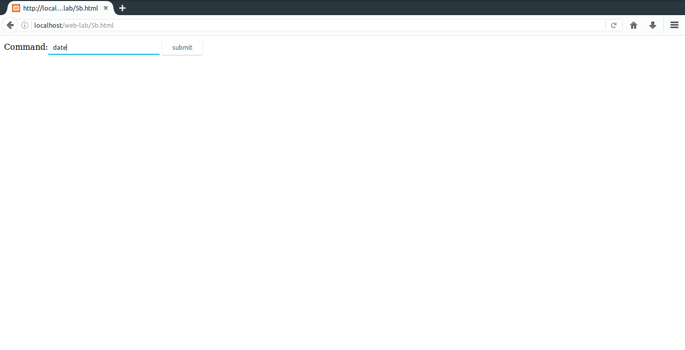

# 5.
#### a) Write a Perl program to display various Server Information like Server Name, Server Software, Server protocol, CGI Revision etc.
#### b) Write a Perl program to accept UNIX command from a HTML form and to display the output of the command executed.
### Important bits
* `%ENV`: A hash map that holds the server environment variables.
* `param(name)`: Gets parameter from name.
* `system(command)`: Executes a shell command.

### File Paths
`/var/www/html/web-lab/5a.html`  
`/usr/lib/cgi-bin/web-lab/5a.cgi`
### Output

### File Paths
`/var/www/html/web-lab/5b.html`  
`/usr/lib/cgi-bin/web-lab/5b.cgi`
### Output

