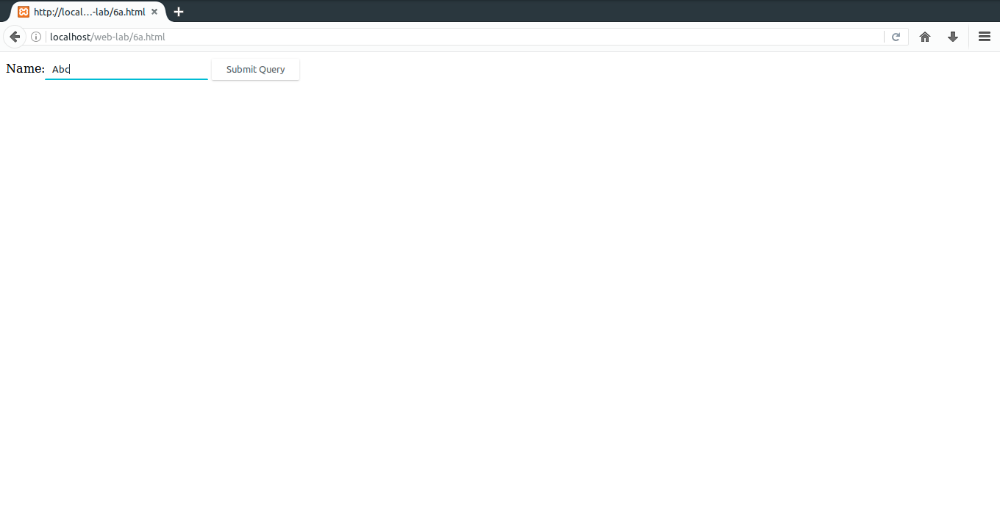
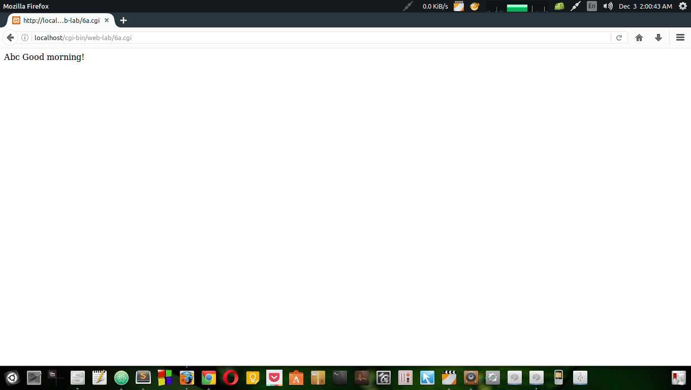
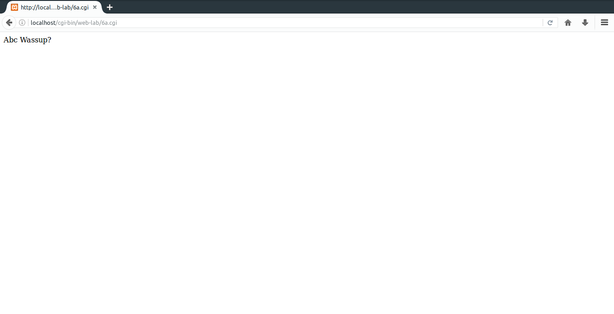
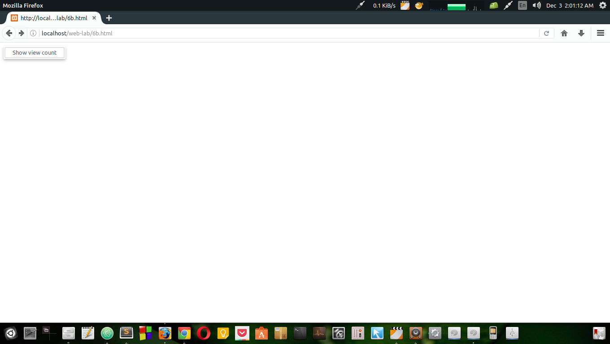
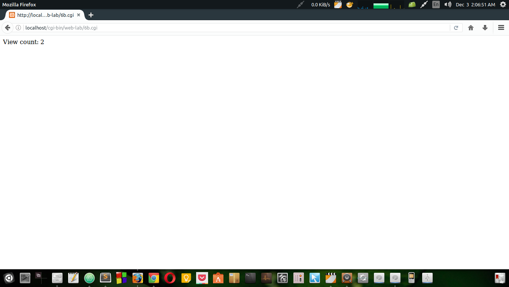

# 6.
#### a) Write a Perl program to accept the User Name and display a greeting message randomly chosen from a list of 4 greeting messages.
#### b) Write a Perl program to keep track of the number of visitors visiting the web page and to display this count of visitors, with proper headings.
### File Paths
`/var/www/html/web-lab/6a.html`  
`/usr/lib/cgi-bin/web-lab/6a.cgi`
### Output

### File Paths
`/var/www/html/web-lab/6b.html`  
`/usr/lib/cgi-bin/web-lab/6b.cgi`
### Output

