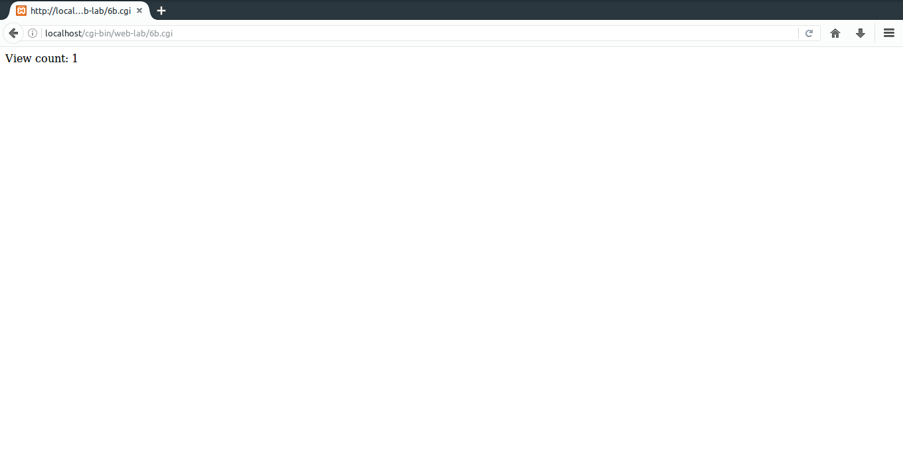

# 6.
#### a) Write a Perl program to accept the User Name and display a greeting message randomly chosen from a list of 4 greeting messages.
### Important Bits
* open() - opens a file if existing otherwise creates a new one. 
* '<filename' is opened for reading. 
* '>filename' is opened for writing starting at the beginning of the file.

### Code (HTML)
**File Path:** ```/opt/lampp/htdocs/web-lab/6a.html```
```html
<html>
	<form action="/cgi-bin/web-lab/6a.cgi" method="post">
		Name:<input type="text" name="username">
		<input type="submit">
	</form>
</html>
```
### Code (Perl)
**File Path:** ```/opt/lampp/cgi-bin/web-lab/6a.cgi```
```perl
#!/usr/bin/perl
use CGI':standard';
print "Content-type:text/html\n\n";

$name=param('username');
@msgs=("Good morning!","How are you?","Wassup?");
print $name," ",@msgs[rand @msgs];
```
### Output


#### b) Write a Perl program to keep track of the number of visitors visiting the web page and to display this count of visitors, with proper headings.
### Code (HTML)
**File Path:** ```/opt/lampp/htdocs/web-lab/6b.html```
```html
<html>
	<form action="/cgi-bin/web-lab/6b.cgi">
		<input type="submit" value="Show view count">
	</form>
</html>
```
### Code (Perl)
**File Path:** ```/opt/lampp/cgi-bin/web-lab/6b.cgi```
```perl
#!/usr/bin/perl
use CGI':standard';
print "Content-type:text/html\n\n";

open(FILE,'<count.txt');	#Open as read-only
$count=<FILE>;				#Get value in file
close(FILE);

$count++;

open(FILE,'>count.txt');	#Open as write-only
print FILE "$count";		#Print value in file
close(FILE);

print "View count: $count";
```
### Output



