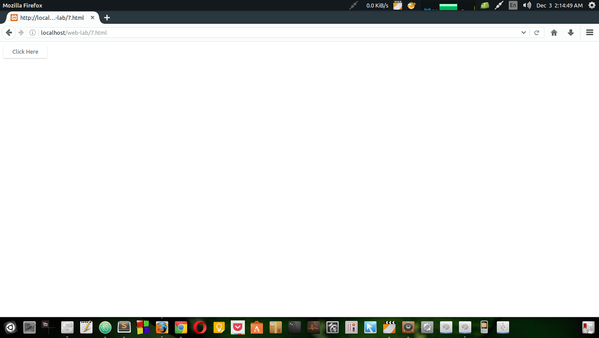
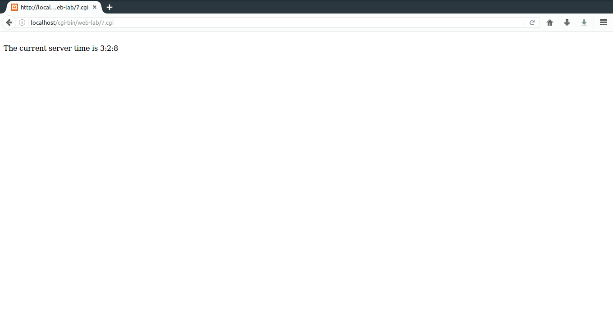

# 7. Write a Perl program to display a digital clock which displays the current time of the server.
### File Paths
`/opt/lampp/htdocs/web-lab/7.html`  
`/opt/lampp/cgi-bin/web-lab/7.cgi`
### Output

