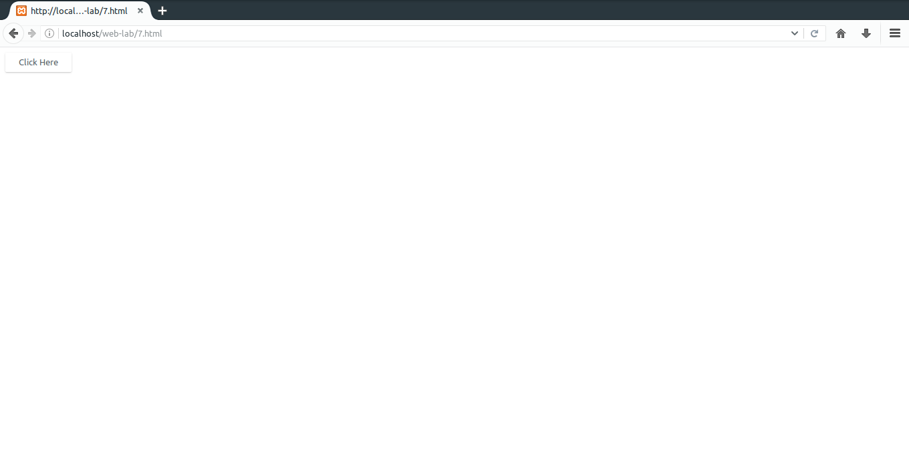

# 7. Write a Perl program to display a digital clock which displays the current time of the server.
### Important bits
* `localtime(time)`: Returns time.

### File Paths
`/var/www/html/web-lab/7.html`  
`/usr/lib/cgi-bin/web-lab/7.cgi`
### Output

