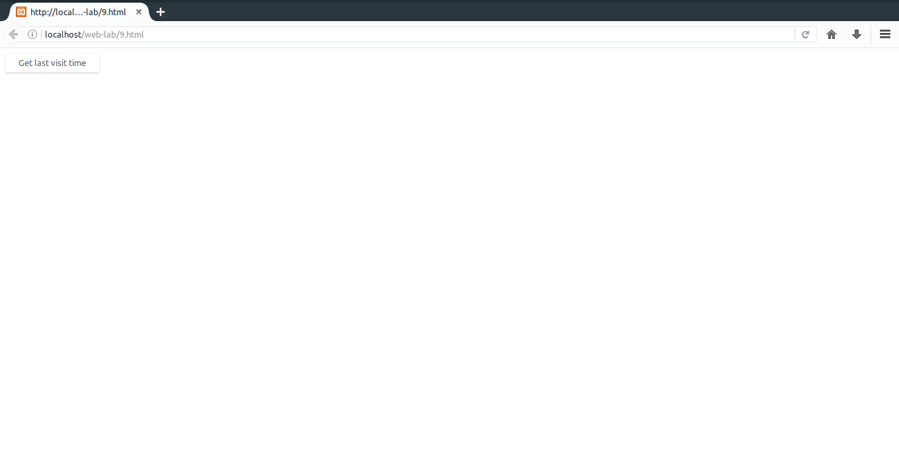
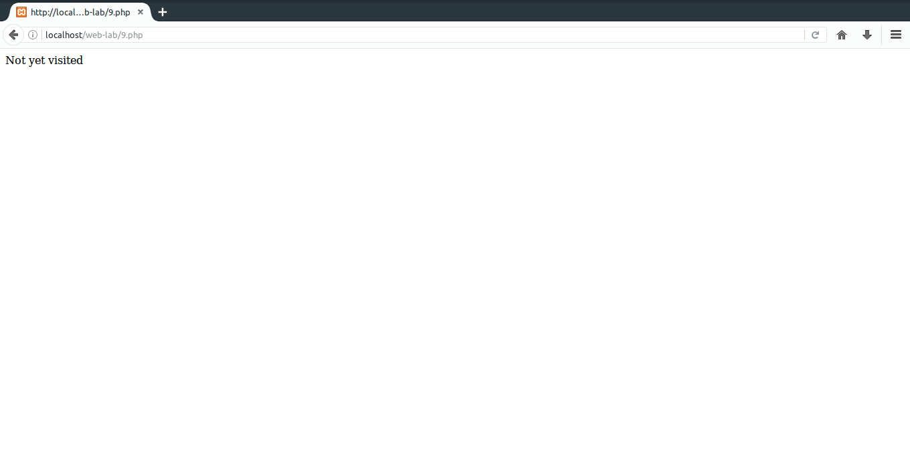
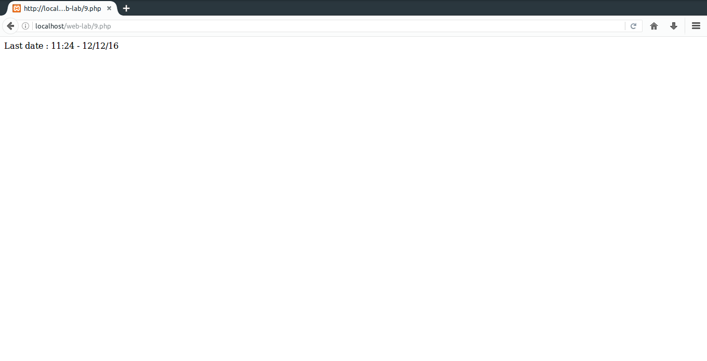

# 9. Write a PHP program to store current date-time in a COOKIE and display the 'Last visited on' date-time on the web page upon reopening of the same page.
### Important bits
* `isset()`: Checks if a clue is present in a hash map.
* `_COOKIE[]`: Hash map that holds all the cookies and their values.
* `setcookie(name,value,expiry)`: Creates a cookie.

### File Paths
`/var/www/html/web-lab/9.html`  
`/var/www/html/web-lab/9.php`
### Output

