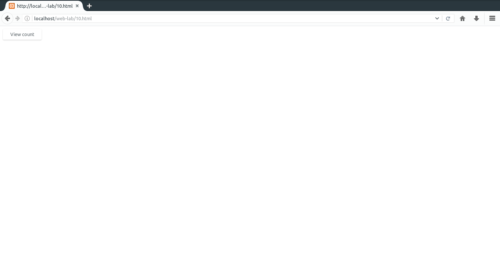

# 10. Write a PHP program to store page views count in SESSION, to increment the count on each refresh, and to show the count on web page.
### Important bits
* `isset()`: Checks if a clue is present in a hash map.
* `_SESSION[]`: Hash map that holds all the session variables and their values.

### File Paths
`/opt/lampp/htdocs/web-lab/10.html`  
`/opt/lampp/htdocs/web-lab/10.php`
### Output

