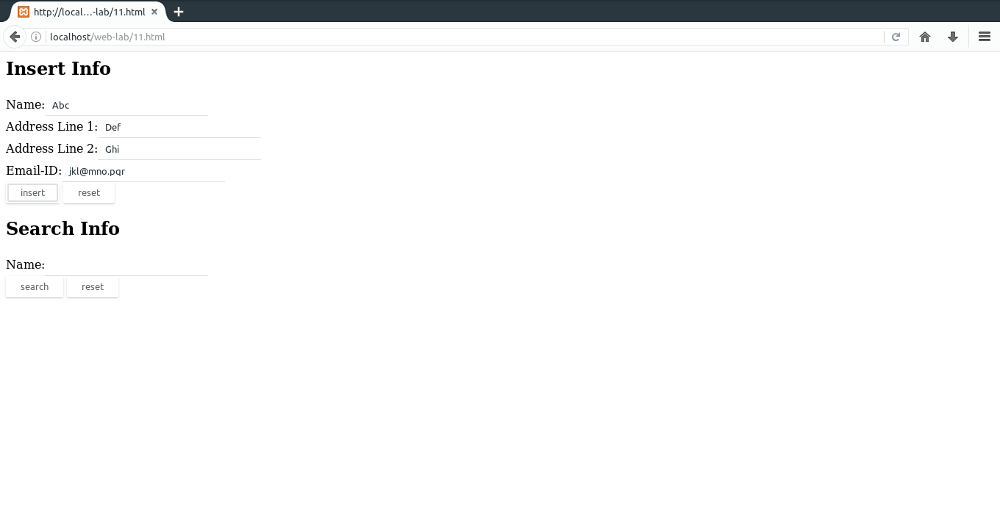
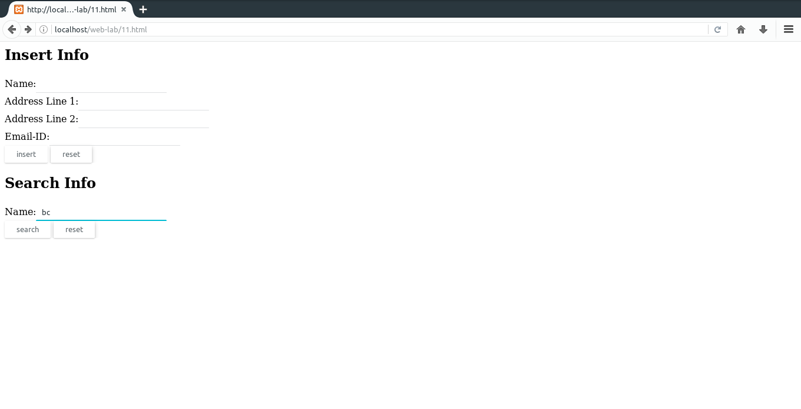
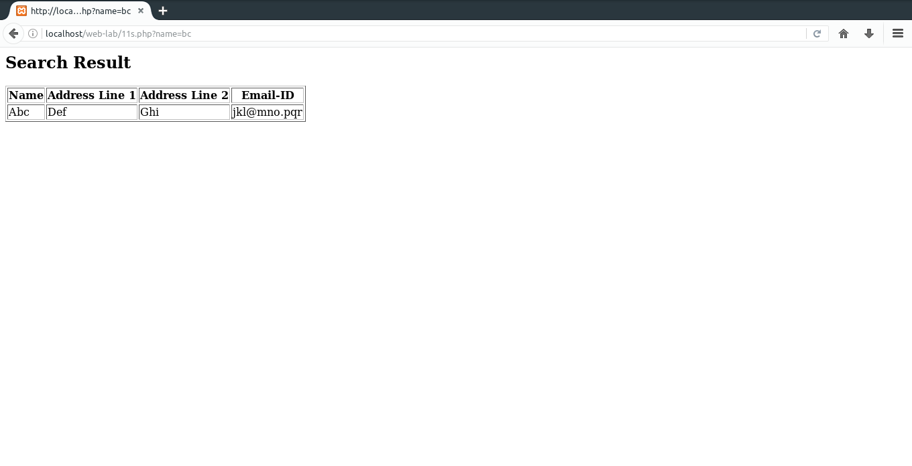

# 11. Create a XHTML form with Name, Address Line 1, Address Line 2, and E-mail text fields. On submitting, store the values in MySQL table. Retrieve and display the data based on Name.
### Important bits
* `mysqli_connect(server,username,pasword)` - Returns connection to database server.
* `mysqli_select_db(connection,database)` - Selects a database.
* `mysqli_query(connection,query_string)` - Returns result of querying the database.
* `mysqli_fetch_array(result)` - Returns output row as an array.
* `mysqli_close(connection)` - Closes database connection.

### File Paths
`/var/www/html/web-lab/11.html`  
`/var/www/html/web-lab/11i.php`  
`/var/www/html/web-lab/11s.php`
### Output

