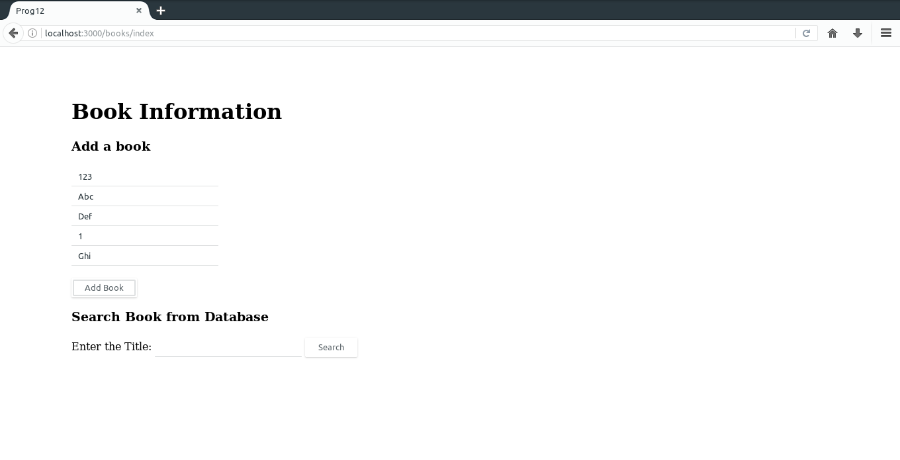
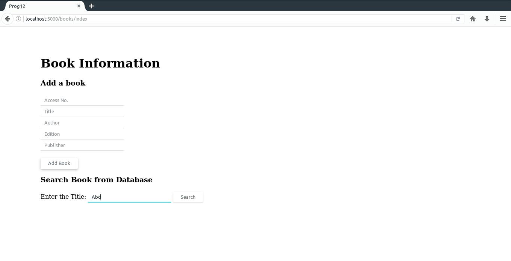
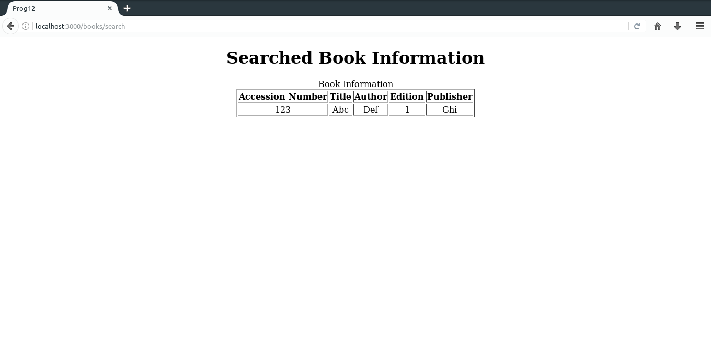

# 12. Build a Rails application to accept book information viz. Access number, Title, Authors, Edition and Publisher from a web page and store the information in a database and to search for a book with the title specified by the user and to display the search results with proper headings.

### Instructions
Run the following commands one by one.

Step | Commands | Explaination
--- | --- | ---
1 | `rails new prog12 -d mysql` | Create new project with MySQL database
2 | `cd prog12` | Enter project directory
3 | `gedit config/database.yml` | Enter the MySQL user password in here...
4 | `rake db:create` | Creates databases **prog12_development** & **prog12_test** in MySQL
5 | `rails generate controller books index` |
6 | `gedit app/controllers/books_controller.rb` | [books_controller.rb](books_controller.rb)
7 | `rails generate model book access_no:integer title:string author:string edition:integer publisher:string` |
8 | `rake db:migrate` |
9 | `gedit app/views/books/index.html.erb` | [index.html.erb](index.html.erb)
10 | `gedit app/views/books/search.html.erb` | [search.html.erb](search.html.erb)
11 | `gedit config/routes.rb` | [routes.rb](routes.rb)
12 | `rails server` | Start Server
**Goto** http://localhost:3000/books/index
### Output

