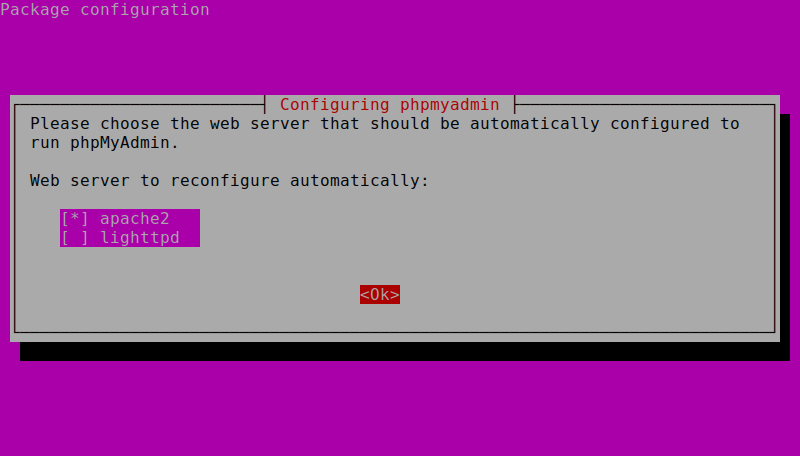

# (10CSL78) Web Programming Lab
### Exercises
1. Develop and demonstrate a XHTML file that includes JavaScript script for the following problems:
  1. Input: A number n obtained using prompt.  
  Output: The first n Fibonacci numbers.
  1. Input: A number n obtained using prompt.  
  Output: A table of numbers from 1 to n and their squares using alert.
1. 
  1. Develop and demonstrate, using JavaScript script, a XHTML document that collects the USN (The valid format is: A digit from 1 to 4 followed by two upper-case characters followed by two digits followed by two upper-case characters followed by three digits; no embedded spaces allowed) of the user. Event handler must be included for the form element that collects this information to validate the input. Messages in the alert windows must be produced when errors are detected.
  1. Modify the above program to get the current semester also (restricted to be a number from 1 to 8).
1. 
  1. Develop and demonstrate, using JavaScript script, a XHTML document that contains three short paragraphs of text, stacked on top of each other, with only enough of each showing so that the mouse cursor can be placed over some part of them. When the cursor is placed over the exposed part of any paragraph, it should rise to the top to become completely visible.
  1. Modify the above document so that when a paragraph is moved from the top stacking position, it returns to its original position rather than to the bottom.
1. 
  1. Design an XML document to store information about a student in an engineering college affiliated to VTU. The information must include USN, Name, Name of the College, Brach, Year of Joining, and e-mail id. Make up sample data for 3 students. Create a CSS style sheet and use it to display the document.
  1. Create an XSLT style sheet for one student element of the above document and use it to create a display of that element.
1. 
  1. Write a Perl program to display various Server Information like Server Name, Server Software, Server protocol, CGI Revision etc.
  1. Write a Perl program to accept UNIX command from a HTML form and to display the output of the command executed.
1. 
  1. Write a Perl program to accept the User Name and display a greeting message randomly chosen from a list of 4 greeting messages.
  1. Write a Perl program to keep track of the number of visitors visiting the web page and to display this count of visitors, with proper headings.
1. Write a Perl program to display a digital clock which displays the current time of the server.
1. Write a Perl program to insert name and age information entered by the user into a table created using MySQL and to display the current contents of this table.
1. Write a PHP program to store current date-time in a COOKIE and display the 'Last visited on' date-time on the web page upon reopening of the same page.
1. Write a PHP program to store page views count in SESSION, to increment the count on each refresh, and to show the count on web page.
1. Create a XHTML form with Name, Address Line 1, Address Line 2, and E-mail text fields. On submitting, store the values in MySQL table. Retrieve and display the data based on Name.
1. Build a Rails application to accept book information viz. Access number, Title, Authors, Edition and Publisher from a web page and store the information in a database and to search for a book with the title specified by the user and to display the search results with proper headings.

### Software Stack
* **Operating system used:** Ubuntu 16.04 LTS (64 bit).   [Linux is required only for a few programs that need shell command execution. For others, Windows may be used.   The instructions and code are tailored specifically for Linux only. Some changes may be required for a few of them to work in Windows.]  
* **Web browser used:** Mozilla Firefox v50.   [It is highly recommended to use Firefox for getting exact output on all programs.]
* **Apache** server
* **MySQL** database
* **PHP with PHPMyAdmin**
* **Perl**
* **Ruby on Rails**   
* Preferred text editor - **[Sublime Text Editor](https://www.sublimetext.com/)** or **[Atom Text Editor](https://atom.io/)** with plugins.

### Installation
Just run `bash` [install.sh](install.sh) in the terminal and watch out for any errors.

**Note**
* You will be prompted to configure/enter password during installation.
* During PHPMyAdmin installation, the configuration must look like this!      [SPACE] to tick/untick   [TAB] to switch between sections   [RETURN] to commit

# **Warning!**
* Some code, typed in Windows doesn't work in Linux. This is due to **Line Endings**. Make sure all code has proper Linux line endings (LF).  
* Every program written in cgi-bin **MUST** have permissions set to **777**. Otherwise, they don't work.   Just perform `sudo chmod 777 *` after saving **EVERY** program in the `cgi-bin` folder.

### Info
`/var/www/html/` - This is the folder for all the HTML,XML, XSL, CSS, PHP files. By default, `localhost/` in your web browser will direct to the contents in this folder. You can create folders inside it to organize your files, but their respective paths must be reflected while accessing through the browser.

`/usr/lib/cgi-bin/` - This is the CGI folder. You can create folders inside it to organize your files, but their respective paths must be reflected inside the codes as well.  

Type `localhost` in the browser to see if its running.
